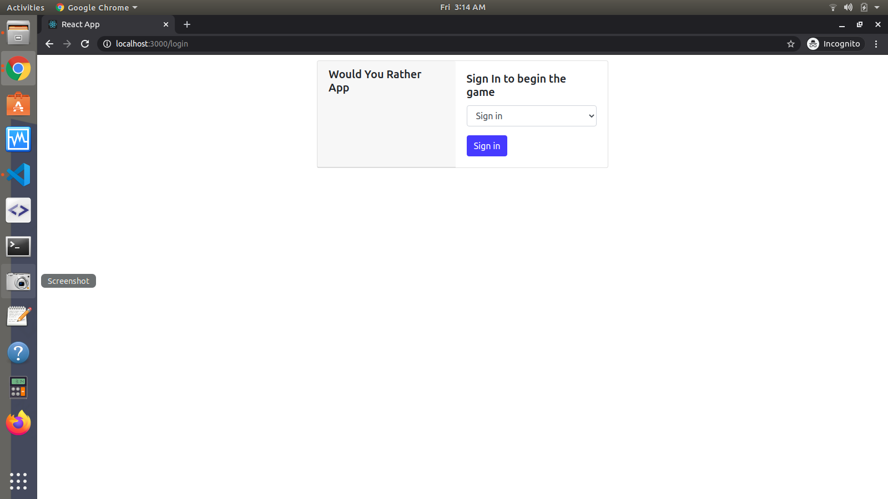
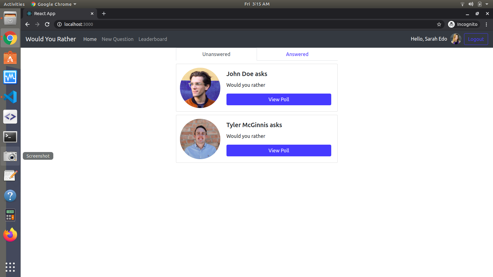
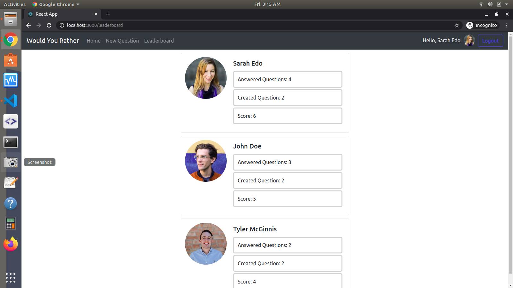
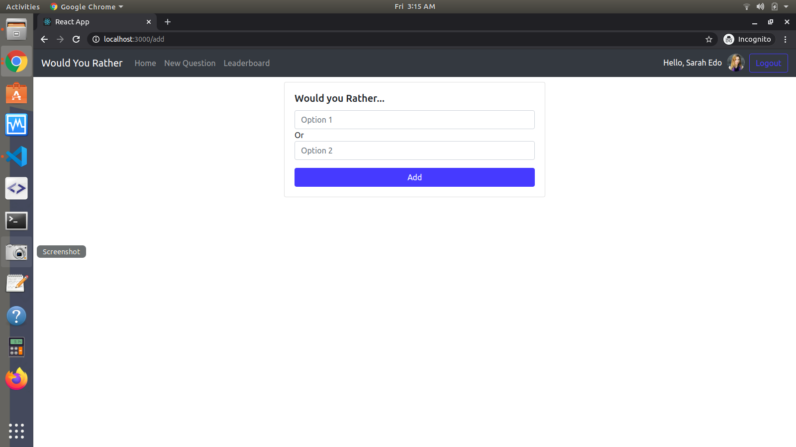

# Would You Rather
This project was bootstrapped with [Create React App](https://github.com/facebookincubator/create-react-app).

# Introduction
This app lets a user play the “Would You Rather?” game. The game goes like this: A user is asked a question in the form: “Would you rather [option A] or [option B] ?”. Answering "neither" or "both" is against the rules. And there is a poll system which indicates the votes for ther user.

# Installation Instructions

Run following commands to start project

* If you are not in the folder then type this command `cd would-you-rather`
* install project dependencies with `npm install`
* start development server with `npm start` or `sudo npm start`
* now open your browser and type url `localhost:3000`

# Screen Shots

## Login Page

## Home Page

## Leaderboard Page

## New Question Page

